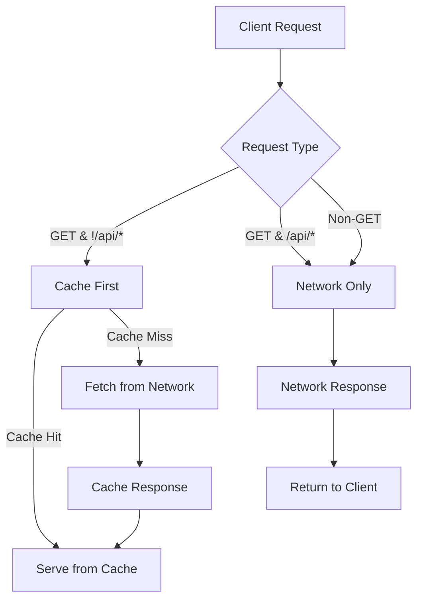

## Overview
The Fut.Manager application is a **single‑page React app** served by a Node/Express backend.  To provide a native‑app‑like experience on mobile devices, the project implements a standard **Progressive Web App (PWA)**.  The PWA consists of three core artifacts:

1. **Web App Manifest** – `/public/manifest.json`.
2. **Service Worker** – `/public/sw.js`.
3. **Meta & Link Tags** – added to `index.html`.

These artifacts work together to enable installation, offline caching, and a standalone launch mode.

## 1. Web App Manifest
The manifest is a JSON file that tells the browser how the app should behave when installed.  Key properties used in this project:

| Property | Value | Purpose |
|----------|-------|---------|
| `name` | *Gestão de Racha – Sistema White‑Label* | Full name shown on the home screen and install prompt. |
| `short_name` | *RachaApp* | Short name used when space is limited. |
| `start_url` | `/` | Entry point after launch. |
| `display` | `standalone` | Launches without browser UI, mimicking a native app. |
| `theme_color` / `background_color` | `#0a0f0d` | Sets the status‑bar and splash screen colors. |
| `icons` | 192×192, 512×512 (PNG & SVG) | Icons for home‑screen, app‑launcher, and OS‑specific requirements. |

The manifest file is referenced from `index.html` via `<link rel="manifest" href="/manifest.json">`.

## 2. Service Worker
The service worker (`/public/sw.js`) implements a **cache‑first strategy** for static assets and a **network‑first strategy** for navigation requests.  The key logic is:

1. **Install** – Cache all assets listed in `STATIC_ASSETS`.
2. **Activate** – Remove old caches that do not match `CACHE_NAME`.
3. **Fetch** –
   * If the request is a non‑GET or an API call (`/api/*`), forward it to the network.
   * If the request is for a document (`destination === 'document'`), try the network first and fall back to the cached `index.html`.
   * For all other requests, serve from cache if available; otherwise fetch from the network, cache the response, and return it.

This approach gives the app fast load times on repeat visits and graceful degradation when offline.

### Service Worker Flow Diagram


## 3. Integration with the Front‑End
`index.html` contains the following meta tags to support mobile‑first UX:

```html
<meta name="viewport" content="width=device-width, initial-scale=1.0, maximum-scale=5.0">
<meta name="apple-mobile-web-app-capable" content="yes">
<meta name="apple-mobile-web-app-status-bar-style" content="black-translucent">
<meta name="apple-mobile-web-app-title" content="RachaApp">
<link rel="apple-touch-icon" href="/pwa/icon-192.svg">
<link rel="manifest" href="/manifest.json">
```

The React app registers the service worker in `src/main.tsx` (via Vite’s default behaviour) so that the worker is installed automatically when the app is built.

## 4. Building & Deploying
During `npm run build`, Vite outputs the static assets to `/dist/`.  The Express server serves these files and the service worker from the same directory.  No additional configuration is required for the PWA to work in production.

## 5. Testing the PWA
1. **Local** – Run `npm run dev` and open the app in Chrome.  Use the **Application** tab in DevTools to inspect the manifest and service worker.
2. **Offline** – In DevTools, toggle **Offline** and reload the page.  The app should still load and display the cached UI.
3. **Installation** – On a mobile device or Chrome’s **Add to Home Screen** prompt, the app should install and launch in standalone mode.

---

## Backlog
- Add a detailed diagram of the service‑worker lifecycle.
- Document how to update the cache version when new assets are added.
