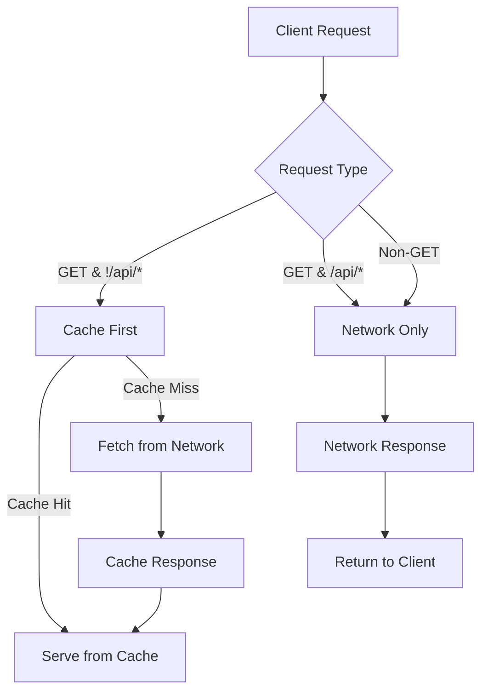

## Visão geral
O aplicativo Fut.Manager é um **aplicativo React de página única** servido por um backend Node/Express. Para oferecer uma experiência semelhante a um aplicativo nativo em dispositivos móveis, o projeto implementa um **Progressive Web App (PWA)** padrão. O PWA consiste em três artefatos principais:

1. **Web App Manifest** – `/public/manifest.json`.
2. **Service Worker** – `/public/sw.js`.
3. **Meta & Link Tags** – adicionadas ao `index.html`.

Esses artefatos trabalham em conjunto para permitir a instalação, cache offline e um modo de lançamento independente.

## 1. Web App Manifest
O manifesto é um arquivo JSON que informa ao navegador como o aplicativo deve se comportar quando instalado. Propriedades-chave usadas neste projeto:

| Propriedade | Valor | Propósito |
|-------------|-------|-----------|
| `name` | *Gestão de Racha – Sistema White‑Label* | Nome completo exibido na tela inicial e no prompt de instalação. |
| `short_name` | *RachaApp* | Nome curto usado quando o espaço é limitado. |
| `start_url` | `/` | Ponto de entrada após o lançamento. |
| `display` | `standalone` | Lança sem a interface do navegador, imitando um aplicativo nativo. |
| `theme_color` / `background_color` | `#0a0f0d` | Define as cores da barra de status e da tela de splash. |
| `icons` | 192×192, 512×512 (PNG & SVG) | Ícones para tela inicial, lançador de aplicativos e requisitos específicos do sistema operacional. |

O arquivo de manifesto é referenciado a partir de `index.html` via `<link rel="manifest" href="/manifest.json">`.

## 2. Service Worker
O service worker (`/public/sw.js`) implementa uma **estratégia cache‑first** para ativos estáticos e uma **estratégia network‑first** para requisições de navegação. A lógica principal é:

1. **Install** – Cache todos os ativos listados em `STATIC_ASSETS`.
2. **Activate** – Remove caches antigos que não correspondem a `CACHE_NAME`.
3. **Fetch** –
   * Se a requisição não for GET ou for uma chamada API (`/api/*`), encaminhe para a rede.
   * Se a requisição for de um documento (`destination === 'document'`), tente a rede primeiro e, em caso de falha, recupere o `index.html` em cache.
   * Para todas as outras requisições, sirva do cache se disponível; caso contrário, busque na rede, cacheie a resposta e retorne-a.

Esta abordagem oferece tempos de carregamento rápidos em visitas repetidas e degradação graciosa quando offline.

### Diagrama de Fluxo do Service Worker


## 3. Integração com o Front‑End
`index.html` contém as seguintes tags meta para suportar UX mobile‑first:

```html
<meta name="viewport" content="width=device-width, initial-scale=1.0, maximum-scale=5.0">
<meta name="apple-mobile-web-app-capable" content="yes">
<meta name="apple-mobile-web-app-status-bar-style" content="black-translucent">
<meta name="apple-mobile-web-app-title" content="RachaApp">
<link rel="apple-touch-icon" href="/pwa/icon-192.svg">
<link rel="manifest" href="/manifest.json">
```

O aplicativo React registra o service worker em `src/main.tsx` (via o comportamento padrão do Vite) para que o worker seja instalado automaticamente quando o aplicativo for construído.

## 4. Construção e Implantação
Durante `npm run build`, o Vite gera os ativos estáticos em `/dist/`. O servidor Express serve esses arquivos e o service worker a partir do mesmo diretório. Nenhuma configuração adicional é necessária para que o PWA funcione em produção.

## 5. Testando o PWA
1. **Local** – Execute `npm run dev` e abra o aplicativo no Chrome. Use a aba **Application** nas DevTools para inspecionar o manifesto e o service worker.
2. **Offline** – Nas DevTools, ative **Offline** e recarregue a página. O aplicativo deve continuar carregando e exibir a UI em cache.
3. **Instalação** – Em um dispositivo móvel ou no prompt **Add to Home Screen** do Chrome, o aplicativo deve instalar e iniciar em modo standalone.

---

## Backlog
- Adicionar um diagrama detalhado do ciclo de vida do service‑worker.
- Documentar como atualizar a versão do cache quando novos ativos forem adicionados.