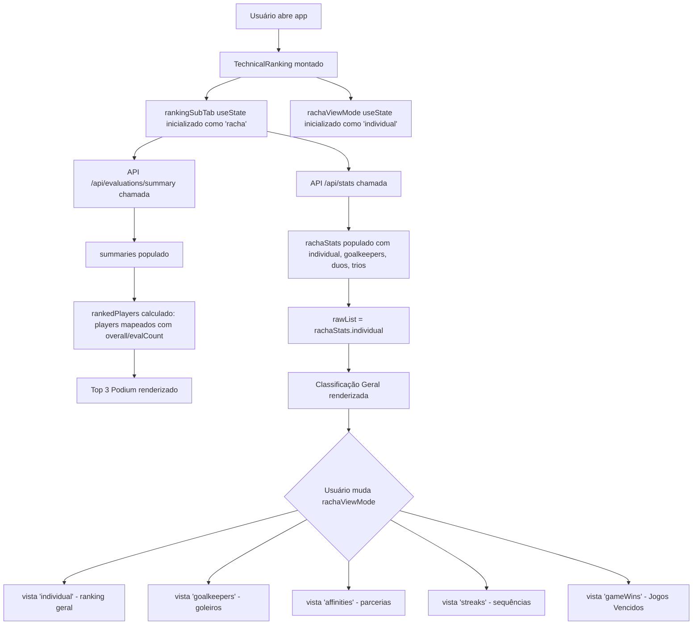

# Classificação Técnica e Ranking do Racha

O componente `TechnicalRanking.tsx` é o núcleo da experiência de ranking do Fut.Manager. Ele apresenta três abas principais que permitem aos usuários visualizar diferentes perspectivas dos dados esportivos:

## Abas Principais

| Aba | Propósito |
|-----|-----------|
| **Ranking do Racha** | Classificação individual baseada em notas técnicas recebidas dos outros atletas |
| **Notas Técnicas (Overall)** | Métricas agregadas de desempenho geral de cada jogador |
| **Hall da Fama** | Conquistas e recordes históricos do grupo |

## Sub-abas da Aba "Ranking do Racha"

Dentro da aba "Ranking do Racha", há cinco sub-abas para visualizações específicas:

### 1. Individual (`individual` - padrão)
Exibe a classificação geral dos jogadores com seus OVR (Overall), notas recebidas e posição.

### 2. Goleiros (`goalkeepers`)
Foco exclusivo nos estatísticas de goleiros profissionais.

### 3. Parcerias (`affinities`)
Mostra o desempenho de duplas (duos) que jogaram juntos, destacando combinações fortes.

### 4. Sequências (`streaks`)
Exibe o maior streak de vitórias consecutivas de cada jogador.

### 5. Jogos Vencidos (`gameWins`) - **Nova funcionalidade (commit 5667216)**

> **Descrição:** Mostra a soma dos jogos vencidos de cada jogador em cada rodada, mesmo quando o time não foi campeão do dia. Isso identifica quem pontua bem consistentemente, sem ser campeão frequentemente.

> **Critério de ordenação:** Ordenado pela propriedade `vitoriasJogos` (soma de jogos vencidos), com desempate por `aproveitamento`.

### Visualização (Jogos Vencidos)

Cada jogador na lista exibe dois indicadores principais:

- **⚡ Jogos Vencidos**: Soma das vitórias individuais em rodadas anteriores
- **🏆 Rodadas Campeão**: Contagem de quantas vezes o time do jogador foi campeão

## Interface do Usuário

### Podium - Prêmios de Elite

A aba "Ranking do Racha" inclui um podium com os 3 primeiros colocados:

- **1º Lugar**: Exibe o melhor OVR com destaque "MELHOR NOTA"
- **2º Lugar**: Segundo melhor OVR
- **3º Lugar**: Terceiro melhor OVR

Cada colocação mostra:
- Avatar do jogador
- Nome e posição
- Nota técnica (OVR)
- Número de votos recebidos
- Botão para avaliar o atleta

### Classificação Geral (Cards Compactos)

Abaixo do podium, uma lista de todos os jogadores com filtros por categoria:
- **Todos** - Todos os jogadores
- **Mensalistas** - Apenas jogadores mensalistas
- **Reservas** - Apenas jogadores reserva
- **Goleiros** - Apenas goleiros

## Dados Computados

O componente consome dados de duas APIs principais:

| API | Endpoint | Dados retornados |
|-----|----------|------------------|
| **Rankings gerais** | `GET /api/evaluations/summary` | Resumo de notas técnicas por jogador |
| **Estatísticas do racha** | `GET /api/stats?seasonId={id}` | Dados detalhados: individual, goalkeepers, duos, trios, steaks |

## Estrutura de Dados (`rachaStats.individual`)

Cada jogador na lista individual possui os seguintes campos relevantes para ranking:

```typescript
{
  playerId: string;
  name: string;
  rank: number;                    // Posição no ranking geral
  overall: number;                   // Nota técnica agregada
  vitorias: number;                  // Quantas rodadas o time foi campeão
  vitoriasJogos: number;             // Soma de jogos vencidos (nova métrica)
  aproveitamento: number;            // % de vitórias
  presences: number;                 // Número de rodadas jogadas
  maxStreak: number;                 // Maior sequência de vitórias
  evalCount: number;                 // Total de notas recebidas
}
```

## Fluxo de Dados



## Mudança Recentes (commit 5667216)

O commit `5667216` ("fix(ranking): move 'Jogos Vencidos' para item de classificacao proprio") introduziu:

1. Adição do tipo `'gameWins'` ao union type de `rachaViewMode`
2. Nova sub-abap com rendered conditional `{rachaViewMode === 'gameWins' && ...}`
3. Ordenação por `vitoriasJogos` ao invés de apenas `aproveitamento`
4. Exibição paralela de "Jogos Vencidos" e "Rodadas Campeão" para contraste

### Objetivo da Mudança

- Identificar jogadores que têm bom desempenho individual (venceram muitos jogos) mesmo não estando frequentemente como campeão do dia
- Fornecer métrica complementar ao ranking tradicional baseado apenas em notas técnicas