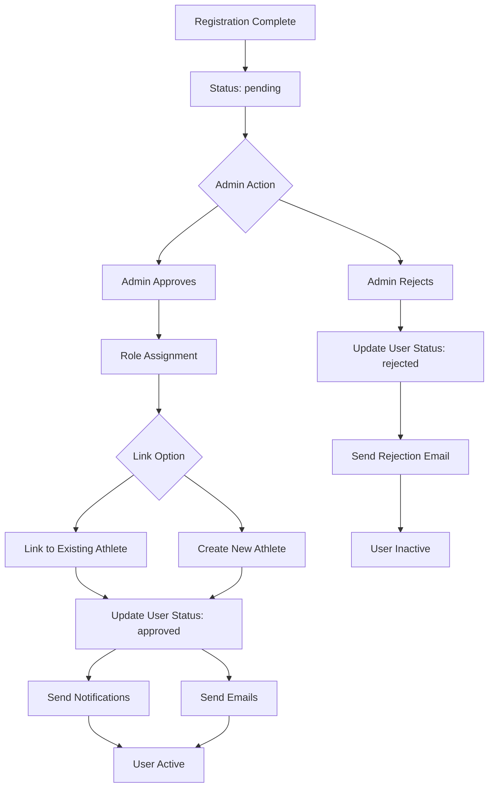

# Fluxo de Gerenciamento de Usuários

Esta página documenta a jornada completa do usuário, desde o registro inicial até a aprovação e participação ativa no Fut.Manager.

## 🎯 Visão Geral

O sistema de gerenciamento de usuários segue um fluxo de aprovação em **três etapas**:

1. **Registro** → Status pendente, aguardando aprovação do administrador
2. **Revisão do Administrador** → Decisão de Aprovar/Rejeitar com atribuição de papel
3. **Ativação** → E-mail de boas-vindas + acesso ao sistema concedido

## 📧 Processo de Registro (`POST /api/auth/register`)

### Estado Inicial

- Um novo usuário cria conta com e-mail, senha e informações básicas
- A conta entra em status **pendente** (`UserStatus.pending`)
- Notificação de boas-vindas gerada, mas **sem acesso** ao painel ainda
- **E-mail de registro pendente** enviado automaticamente para informar ao usuário o tempo de espera esperado (~2 dias)

### Operações no Banco de Dados

```typescript
// Create user record
{
  id: string,
  name: string,
  email: string,
  role: 'admin' | 'auxiliar' | 'jogador', // Always 'jogador' initially
  status: 'pending', // Starting status
  createdAt: ISO date
}
```

### Comunicação por E-mail

- **Assunto**: `Cadastro recebido — [AppName]`
- **Corpo**: Explica o processo de aprovação pendente e o cronograma estimado
- **Ação**: O usuário recebe a notificação, mas não pode acessar o sistema

## 👥 Revisão do Administrador (`POST /api/users/action`)

### Controle de Acesso

Somente usuários com papel **admin** podem aprovar/rejeitar contas.

### Ações de Aprovação Disponíveis

#### 1. Aprovar Usuário (`action: 'approve'`)

Quando o administrador aprova, o sistema executa **várias operações coordenadas**:

**A. Atribuição de Papel**

- Atribuir papel: admin, auxiliar ou jogador (com base na escolha do administrador)
- Definir status para: `approved`

**B. Vinculação de Perfil**

O administrador escolhe entre duas abordagens:

**Opção A: Vincular ao Atleta Existente**

```typescript
if (linkOption === 'existing' && selectedPlayerId) {
  // Associate user with existing player record
  user.playerId = selectedPlayerId;
  // Audit log entry created
}
```

**Opção B: Criar Novo Perfil de Atleta**

```typescript
// Auto-generate player record with defaults
{
  id: 'player-' + timestamp,
  name: user.name,
  phone: providedPhone,
  category: 'reserva' | 'mensalista',
  primaryPosition: 'atacante' | 'goleiro' | ...,
  secondaryPositions: [],
  status: 'disponivel',
  // ... other defaults
}
```

**C. Registro de Auditoria**

Cada ação é registrada em `userAudits` com:

- Carimbo de data/hora
- Detalhes do usuário (nome, e-mail)
- Tipo de ação e descrição
- Valores anteriores e novos
- Realizado pelo nome do administrador

**D. Notificações disparadas**

Duas notificações enviadas:

1. **Direto ao usuário**: `🎉 Cadastro Aprovado!` com mensagem de boas-vindas
2. **Transmissão do sistema**: `🏃 Novo Jogador no Grupo` (para todos os usuários)

**E. E-mails Enviados**

Se o sistema de e-mail estiver configurado:

1. **E-mail de aprovação**: modelo `registration-approved` com link de login
2. **E-mail de boas-vindas**: modelo `welcome` com informações de acesso ao aplicativo

#### 2. Rejeitar Usuário (`action: 'reject'`)

- Definir status para: `rejected`
- **E-mail de rejeição** enviado com explicação
- O usuário não pode se registrar novamente até que o administrador intervenha

#### 3. Atualizar Papel (`action: 'update_role'`)

- Alterar papel do usuário entre admin/auxiliar/jogador
- Também pode atualizar a vinculação do perfil de atleta
- Requer validação cuidadosa (não pode demitir o último administrador)

## 📊 Máquina de Estado



## 🎮 Lógica de Atribuição de Posição

Quando novos perfis de atleta são criados:

### Regras de Posição Primária

- **Mensalistas** (membros pagos): Não podem ser atribuídos como `goleiro` a menos que haja exceção especial
- **Reserva** (reservas): Podem ocupar qualquer posição, incluindo goleiro
- **Validação do sistema**: Impede atribuições de posição inválidas

### Gerenciamento de Posição Secundária

- Array vazio por padrão
- Pode ser definido durante a aprovação do administrador
- Usado pelo motor de atribuição tática (`DashboardStatus.tsx`)

### Atribuição Tática

A função `computeTacticalAssignments()` em `DashboardStatus.tsx` utiliza:

- `primaryPosition` (peso 10 pontos)
- `secondaryPositions` (peso 6 pontos)
- Penalidade especial (-50) por atribuir um não-goleiro como goleiro

## 🔐 Controles de Segurança

### Matriz de Autorização

| Ação | Papel Requerido | Verificações Adicionais |
|------|-----------------|------------------------|
| Aprovar Usuário | admin | Não pode rejeitar o último administrador |
| Rejeitar Usuário | admin | Não pode rejeitar usuário-admin |
| Atualizar Papel | admin | Não pode demitir o último administrador |
| Ver Pendente | admin/auxiliar | Ver apenas as próprias permissões |

### Proteção de Dados

- **Proteção de administrador raiz**: `user-admin` não pode ser rejeitado ou demitido
- **Proteção do último administrador**: O sistema impede a remoção do único administrador ativo
- **Registro de auditoria**: Todas as alterações são registradas com contexto completo

## 📈 Métricas e Monitoramento

### Eventos Chave Monitorados

- Volume de registros (diário/semanal)
- Taxas de aprovação/rejeição
- Tempo médio de aprovação
- Taxas de sucesso de entrega de e-mails
- Distribuição de posições na equipe ativa

### Recursos do Painel de Administração

- Ações em massa: Processar vários usuários pendentes de forma eficiente
- Pesquisar e filtrar: Encontrar usuários por nome, e-mail ou status
- Vinculação em lote: Conectar jogadores existentes a contas de usuário
- Gerenciamento de papéis: Alterar permissões em massa

## 🔄 Melhorias Futuras (Backlog)

- Atualizações de papel autogerenciadas para usuários não-administradores
- Fluxos de reativação automatizados para usuários rejeitados
- Análises avançadas de posição e previsão
- Integração com provedores de identidade externos (Google, GitHub)

## 📋 Referência Rápida

### Operações Comuns

**Aprovar Usuário com Novo Perfil:**

```bash
# Admin action in UserApprovalList component
await handleAction(userId, 'approve', customRole)
```

**Rejeitar Usuário:**

```bash
# Admin action in UserApprovalList component
await handleAction(userId, 'reject')
```

**Atualizar Papel do Usuário:**

```bash
# Admin action for linking to existing player
await handleAction(userId, 'approve', role, {
  linkOption: 'existing',
  selectedPlayerId: 'player-123'
})
```