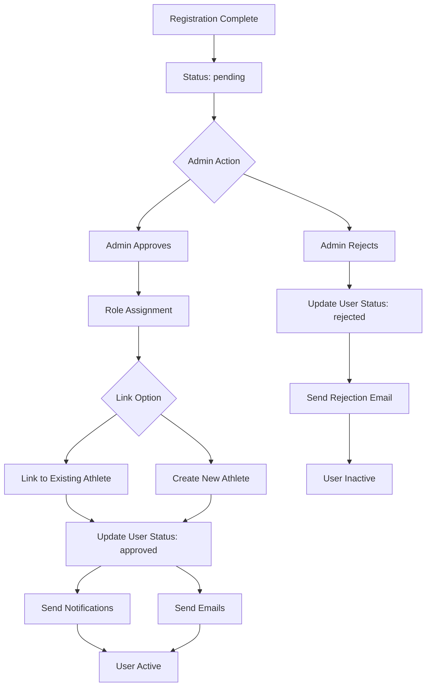

# User Management Workflow

This page documents the complete user journey from initial registration through approval to active participation in Fut.Manager.

## 🎯 Overview

The user management system follows a **three-step approval workflow**:

1. **Registration** → Pending status, waiting for admin approval
2. **Admin Review** → Approve/Reject decision with role assignment
3. **Activation** → Welcome email + system access granted

## 📧 Registration Process (`POST /api/auth/register`)

### Initial State
- New user creates account with email, password, and basic info
- Account enters **pending** status (`UserStatus.pending`)
- Welcome notification generated but **no access** to dashboard yet
- **Registration-pending email** sent automatically to inform user of expected wait time (~2 days)

### Database Operations
```typescript
// Create user record
{
  id: string,
  name: string,
  email: string,
  role: 'admin' | 'auxiliar' | 'jogador', // Always 'jogador' initially
  status: 'pending', // Starting status
  createdAt: ISO date
}
```

### Email Communication
- **Subject**: `Cadastro recebido — [AppName]`
- **Body**: Explains pending approval process and estimated timeline
- **Action**: User receives notification but cannot access system

## 👥 Admin Review (`POST /api/users/action`)

### Access Control
Only users with **admin role** can approve/reject accounts.

### Approval Actions Available

#### 1. Approve User (`action: 'approve'`)
When admin approves, the system performs **multiple coordinated operations**:

**A. Role Assignment**
- Assign role: admin, auxiliar, or jogador (based on admin's choice)
- Set status to: `approved`

**B. Profile Linking**
Admin chooses between two approaches:

**Option A: Link to Existing Athlete**
```typescript
if (linkOption === 'existing' && selectedPlayerId) {
  // Associate user with existing player record
  user.playerId = selectedPlayerId;
  // Audit log entry created
}
```

**Option B: Create New Athlete Profile**
```typescript
// Auto-generate player record with defaults
{
  id: 'player-' + timestamp,
  name: user.name,
  phone: providedPhone,
  category: 'reserva' | 'mensalista',
  primaryPosition: 'atacante' | 'goleiro' | ...,
  secondaryPositions: [],
  status: 'disponivel',
  // ... other defaults
}
```

**C. Audit Trail**
Every action is logged to `userAudits` with:
- Timestamp
- User details (name, email)
- Action type and description
- Previous and new values
- Performed by admin name

**D. Notifications Triggered**
Two notifications sent:
1. **Direct to user**: `🎉 Cadastro Aprovado!` with welcome message
2. **System broadcast**: `🏃 Novo Jogador no Grupo` (to all users)

**E. Emails Sent**
If email system is configured:
1. **Approval email**: `registration-approved` template with login link
2. **Welcome email**: `welcome` template with app access information

#### 2. Reject User (`action: 'reject'`)
- Set status to: `rejected`
- **Rejection email** sent with explanation
- User cannot re-register until admin intervenes

#### 3. Update Role (`action: 'update_role'`)
- Change user's role between admin/auxiliar/jogador
- Can also update athlete profile linkage
- Requires careful validation (cannot demote last admin)

## 📊 State Machine



## 🎮 Position Assignment Logic

When new athlete profiles are created:

### Primary Position Rules
- **Mensalistas** (paid members): Cannot be assigned as `goleiro` unless special exception
- **Reserva** (reserves): Can be any position including goalkeeper
- **System validation**: Prevents invalid position assignments

### Secondary Position Management
- Empty array by default
- Can be set during admin approval
- Used by tactical assignment engine (`DashboardStatus.tsx`)

### Tactical Assignment
The `computeTacticalAssignments()` function in `DashboardStatus.tsx` uses:
- `primaryPosition` (weight 10 points)
- `secondaryPositions` (weight 6 points)
- Special penalty (-50) for assigning non-goalie as goalkeeper

## 🔐 Security Controls

### Authorization Matrix
| Action | Required Role | Additional Checks |
|--------|---------------|-------------------|
| Approve User | admin | Cannot reject last admin |
| Reject User | admin | Cannot reject admin-user |
| Update Role | admin | Cannot demote last admin |
| View Pending | admin/auxiliar | See only own permissions |

### Data Protection
- **Root admin protection**: `user-admin` cannot be rejected or demoted
- **Last admin protection**: System prevents removing the only active administrator
- **Audit logging**: All changes tracked with full context

## 📈 Metrics and Monitoring

### Key Events Tracked
- Registration volume (daily/weekly)
- Approval/rejection ratios
- Average approval time
- Email delivery success rates
- Position distribution in active roster

### Admin Dashboard Features
- **Bulk actions**: Process multiple pending users efficiently
- **Search and filter**: Find users by name, email, or status
- **Batch linking**: Connect existing players to user accounts
- **Role management**: Change permissions in bulk

## 🔄 Future Enhancements (Backlog)

- Self-service role updates for non-admin users
- Automated re-activation workflows for rejected users
- Advanced position analytics and forecasting
- Integration with external identity providers (Google, GitHub)

## 📋 Quick Reference

### Common Operations
**Approve User with New Profile:**
```bash
# Admin action in UserApprovalList component
await handleAction(userId, 'approve', customRole)
```

**Reject User:**
```bash
# Admin action in UserApprovalList component
await handleAction(userId, 'reject')
```

**Update User Role:**
```bash
# Admin action for linking to existing player
await handleAction(userId, 'approve', role, {
  linkOption: 'existing',
  selectedPlayerId: 'player-123'
})
```